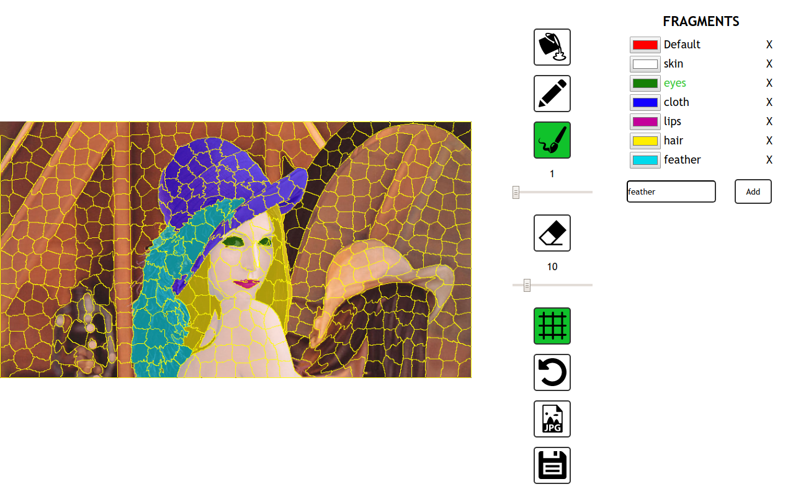
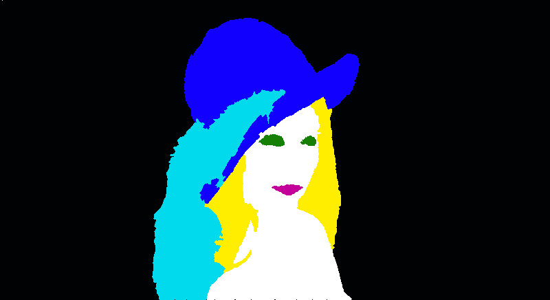

## Superpixel Annotator

Annotation tool for ML training process. Based on SLIC, OPENCV, WebAssembly. Golang version.

Allows you to easily produce manually created bitmap output.

**Input**

**Possible Output**

**Features**

* Image segmentation with SLIC
* Custom contour drawing
* Segments marge with Ctrl/Cmd + Mouse Click
* Custom brush drawing without smoothing
* Undo
* Zoom and drag with Shift + Mouse down

*OPENCV wasm module taken from [WebSight](https://github.com/Web-Sight/WebSight) project*